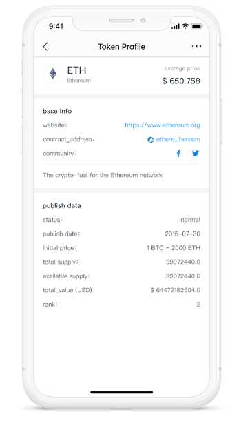

# Token Profile ガイドライン

*他の言語で読む: [English](README.md), [简体中文](README.zh-CN.md), [日本語](README.ja-JP.md).*

このリポジトリは、GitHubを通じてimTokenに**トークン**情報を自己提出する方法を提供します。

## トークンプロファイルとは？

トークンプロファイルは、プロジェクトチームが発行するトークンの詳細情報です。imToken 2.0は、トークンプロファイルの専用表示ページを提供し、ユーザーにトークンの全体像をよりよく理解してもらうことを目的としています。
ページの場所は次のとおりです：
**ウォレット（タブ）** -> **トークン（例：ETH）** -> **トークンプロファイルボタン（右上隅）**。

ページは次のように表示されます：

## 概要

imTokenは、ERC20およびEOSトークンプロファイルの提出をサポー��しています。具体的な手順については、対応するチュートリアルを選択してください：
- [ERC20トークンプロファイルガイドライン](tutorial/erc20-tutorial.en.md)
- [EOSトークンプロファイルガイドライン](tutorial/eos-tutorial.en.md)

## 提案

トークンプロファイルの提出には、GitHubの使用、ロゴデザイン、プロジェクト情報の紹介など、多くの側面が関わるため、**トークンプロファイルの提出は、マーケティング担当者、開発者、デザイナーが協力して行うことをお勧めします。**

imTokenは、申請を5営業日以内に処理します。

## 著作権

2021&copy;imToken PTE. LTD.
